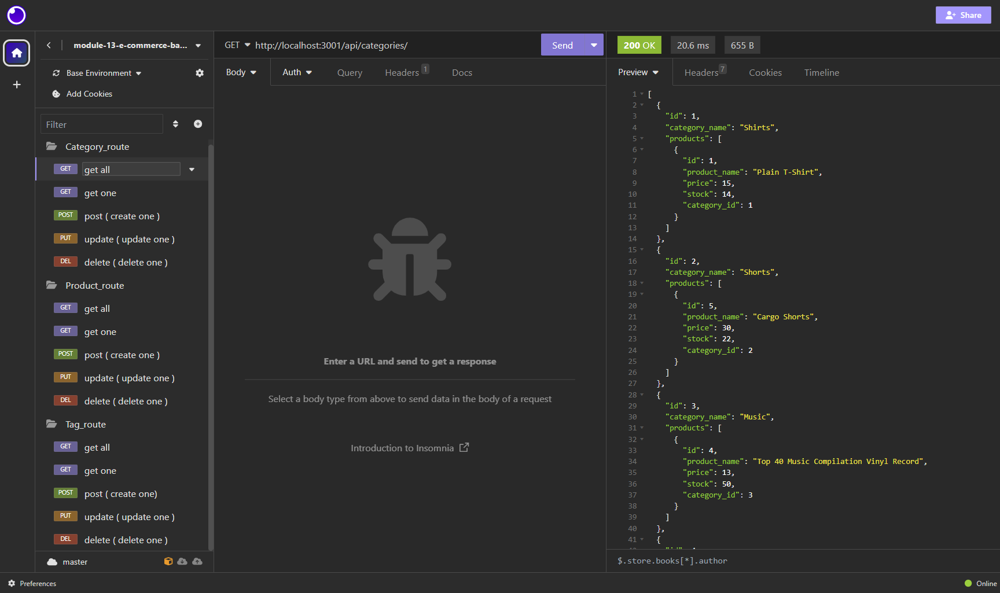

# E-commerce Back End

## Description

This e-commerce back end app, created by ylf456 for study purposes, utilizes JavaScript, Node.js, Express, and MySQL.

## Installation

To set up this application, ensure you have the following:

Code editor
Javascript
Node.js
MySQL

and install the required npm packages: mysql2, sequelize, dotenv, express.

## Usage

Before using the application, install the latest version of Node.js, MySQL, and a code editor (such as VS Code) on your device. 
Download the application folder from GitHub repo: https://github.com/ylf456/module-13-challenge-ylf456-E-commerce-Back-End.git

To use this application:

1. Open the terminal in your code editor and change the directory to root folder
2. type `mysql -u root -p` (if you have password) or `mysql -u root` to enter your MySQL shell.
3. In mysql shell: type `source ./db/schema.sql` to switch to `ecommerce_db` database;
4. type `quit` to exit MySQL shell
5. type `npm i` in the terminal to install required npm packages
6. type `npm run seed`  to seed the database.
7. type `npm run start` or `npm start` to sync the database and turn on server
8. testing out the routes with `get` , `post`, `put` and `delete` calls on your local server.

Also refer to the demo video for more details:
https://drive.google.com/file/d/11WM63YRgzQV8CyVXMAqOuCITost5NZH3/view

## Credits

N/A

## License

N/A

## Link to this application

Demo video: https://drive.google.com/file/d/11WM63YRgzQV8CyVXMAqOuCITost5NZH3/view

github Repo: https://github.com/ylf456/module-13-challenge-ylf456-E-commerce-Back-End.git

## Screenshots

